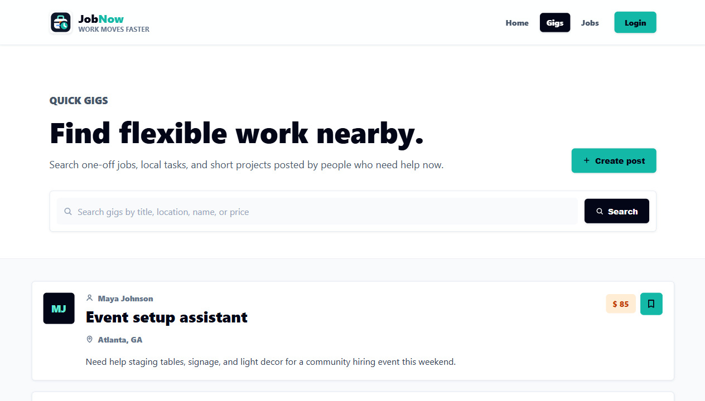
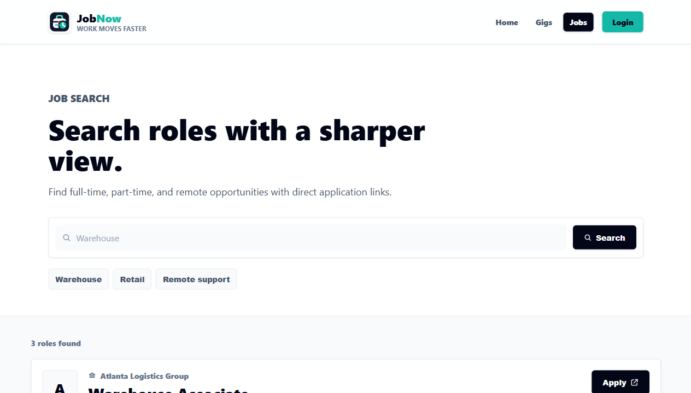
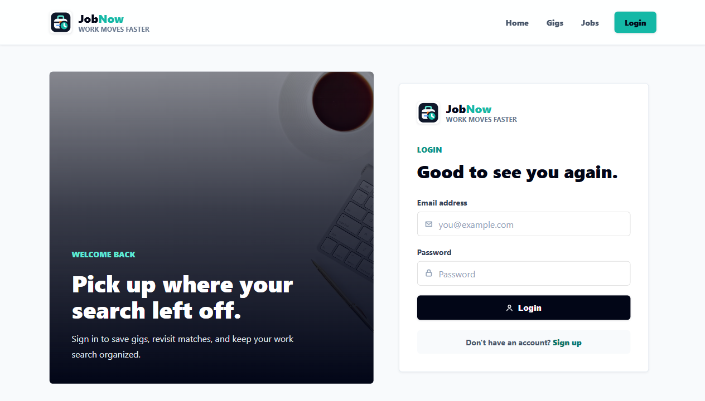

# JobNow

Production Website Link: https://jobnow.onrender.com/

JobNow is a work marketplace for people who want to move quickly between flexible local gigs and longer-term job opportunities. The app gives users a polished landing page, a searchable gigs board, a job-search view powered by JSearch, account creation and login, and a saved-gigs workspace for keeping track of promising short-term work.

## Technologies Used

- React
- Vite
- React Router
- Tailwind CSS
- Ant Design
- Axios
- JavaScript
- Python
- Flask
- Flask-Cors
- SQLite
- RapidAPI JSearch API
- Render

## Features

- Responsive landing page that introduces JobNow and routes users to gigs or jobs.
- Gig marketplace with searchable local posts, pricing, location details, and descriptions.
- Create-gig modal for posting new short-term work opportunities.
- User signup and login backed by a Flask API and SQLite database.
- Bookmarking flow for saving and removing gigs from a personal shortlist.
- Saved gigs page that loads a user's bookmarked gig posts.
- Job search page that fetches external listings from the JSearch API.
- Direct apply links for job-search results.

## Screenshots

| Home | Gigs |
| --- | --- |
|  |  |
| Jobs | Login |
|  |  |

## Setup Instructions

### Prerequisites

- Node.js and npm
- Python 3
- A RapidAPI account with access to the JSearch API

### Server Setup

1. Navigate to the server folder:

   ```bash
   cd server
   ```

2. Create a `.env` file:

   ```env
   FLASK_SECRET_KEY=supersecretkey
   DATABASE_URL=sqlite:///database.db
   ```

3. Create and activate a virtual environment.

   macOS/Linux:

   ```bash
   python3 -m venv .venv
   source .venv/bin/activate
   ```

   Windows:

   ```bash
   py -3 -m venv .venv
   .venv\Scripts\activate
   ```

4. Install Python dependencies:

   ```bash
   pip install -r requirements.txt
   ```

5. Initialize the database:

   ```bash
   python init.py
   ```

6. Start the Flask server:

   ```bash
   python server.py
   ```

### Client Setup

1. Open a second terminal and navigate to the client folder:

   ```bash
   cd client
   ```

2. Create a `.env` file and add your JSearch API key:

   ```env
   VITE_API_KEY=your-rapidapi-key
   ```

3. Install client dependencies:

   ```bash
   npm install
   ```

4. If you want the client to use your local Flask server, update `client/src/config.js`:

   ```js
   const API_URL = "http://localhost:5000";
   ```

5. Start the Vite development server:

   ```bash
   npm run dev
   ```
